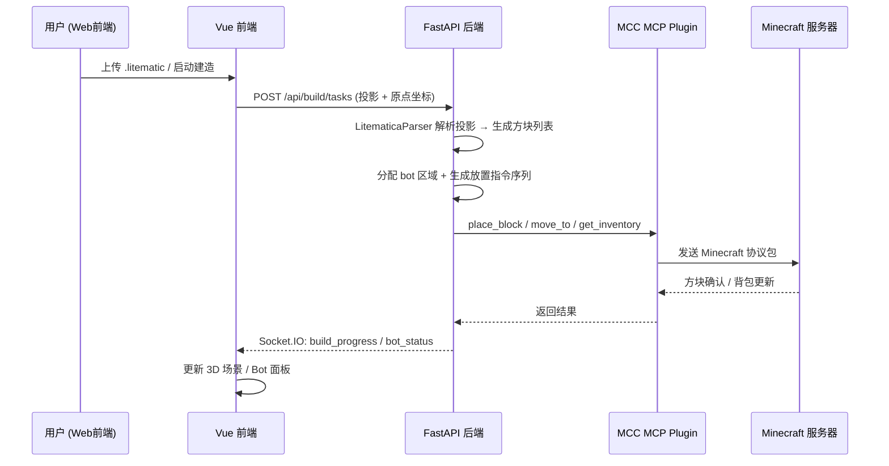

# 地图画自动建造系统 — 开发提示词

> 创建日期：2026-07-28
> 状态：需求分析 & 技术验证阶段
> 前置文档：`docs/dev/mcc-capability-verification.md`（MCC 能力验证）

---

## 项目上下文

VMTools-Web 是一个 MCC bot 远程管理平台。当前架构：

```
前端 (Vue 3 + Element Plus) ←→ FastAPI 后端 ←→ MCC MCP Plugin (JSON-RPC 2.0)
                                                  ↓
                                            MCC 子进程 (实际控制 Minecraft bot)
```

**已有建造相关代码：**
- 后端：`build_state_machine.py`（18 状态建造状态机）、`mcc_printer.py`（MccPrinterAdapter 逐块放置）、`mcc_litematica.py`（投影解析+方块验证）、`inventory_scanner.py`（背包扫描）、`warehouse_scanner.py`（仓库扫描）
- 前端：`BuildTaskListView.vue`（任务列表）、`BuildTaskDetailView.vue`（任务详情，仅进度/层数的简单展示）、`BuildTaskCard.vue`（任务卡片组件）、`BotManageView.vue`（Bot 管理主页，展示实例卡片 + HP/饱食度条）

**已有 Bot 管理前端能力（BotManageView.vue）：**
- 实例卡片列表（名称、在线状态、HP-FD 条、Bot 连接状态）
- 内嵌终端面板（xterm.js）
- 账号配置编辑
- 文件管理面板

**已有数据流：**
- `useBotStore`：管理 bot 列表、在线状态、`current_health`、`current_food`、`current_build_task_id`
- `useBuildStore`：管理建造任务、`current_layer`、`total_layers`、`current_state`
- Socket.IO 事件：`build_progress`（建造进度推送）、`bot_status_update`（bot 状态变更）
- 初始同步：`sync_update` 事件推送 bots/warehouses/active_task_runs

**技术栈限制：**
- 前端目前**没有引入任何 3D 库**（package.json 只有 echarts 2D 图表）
- MCC 与后端的结构化数据交互通过 MCP HTTP API（65 个方法），不通过终端输出
- MCC MCP Plugin 是外部依赖（`MinecraftClient-20260625-476-win-x86.exe`），可魔改其 C# 源码

**MCC 配置前置条件（`MinecraftClient.ini`）：**
以下配置项是建造功能的前置依赖，研究前必须先确认：
```ini
# 物品栏操作（需求一、三的硬前提）
[InventoryHandling]
enabled = true

# 地形/移动/方块扫描（需求二、五、六的硬前提）
[TerrainAndMovements]
enabled = true

# MCP 插件本身
[McpPlugin]
enabled = true
```
如果这些未启用，MCP 的物品栏和方块方法将全部不可用。需要确认当前 `venus_yu001` 实例的 `.ini` 配置。

**MCC MCP Plugin 源码位置：**
魔改 MCC 前需要定位 MCP Plugin 的 C# 源码。MCC 是 .NET 项目，MCP Plugin 通常位于：
- 编译产物：`MinecraftClient-*/McpPlugin.dll`（随 exe 分发）
- 源码：MCC GitHub 仓库中 `MinecraftClient/Plugins/McpPlugin/` 目录
- 需要反编译 `.dll` 或 clone MCC 源码来确认具体实现

**建造功能核心数据流：**



---

## 总体目标

开发一个**多 bot 协作的地图画自动建造系统**，包含后端协调引擎和前端 3D 可视化监控面板。

"地图画"（Map Art）特性：通常是一个 128×128 的二维平面，方块类型就是颜色（如各色羊毛、混凝土），层数极少（通常 1 层），寻路压力远小于三维建筑。

---

## 需求一：Bot 背包实时数据

**目标：** 后端能够实时获取每个 bot 的背包物品详细数据，并能进行有效的交互操作。

**已有基础：**
- `MccMcpClient.get_inventory_snapshot(inventory_id=0)` — 获取玩家背包快照
- `InventoryScanner.scan()` — 返回 `{item_id: count}` 字典
- `BuildStateMachine.CHECK_INVENTORY` 阶段已在使用

**需要深入研究的问题：**

1. **实时性验证**
   - `get_inventory_snapshot` 的响应延迟是多少？MCP 调用是同步等待还是异步通知？
   - MCC 的 Inventory Handling 是服务端推送更新还是客户端轮询？背包变化后多久能反映到 MCP API？
   - 是否有 MCP 事件订阅机制（如 `inventory_changed` 事件），还是只能主动轮询？

2. **数据完整性**
   - 返回的 slot 数据结构包含哪些字段？（type、count、damage、nbt、display_name、enchantments？）
   - 能否区分同名物品的不同 NBT 数据？（如附魔书、染色羊毛 vs 白色羊毛）
   - 快捷栏（0-8）、主栏（9-35）、盔甲（36-39）、副手（40）的槽位索引是否和游戏内一致？

3. **交互操作验证**
   - `inventory_window_action` 的 ShiftClick 能否正确将物品在背包和打开的容器间移动？
   - `change_hotbar_slot` 切换后，`get_inventory_snapshot` 能否立即反映变化？
   - `select_hotbar_item` 在物品不存在时的行为是什么？（报错？静默失败？）

4. **性能考量**
   - 多 bot（如 8 个）同时高频轮询背包（1 秒一次），MCP 服务端能否承受？
   - 是否需要做本地缓存 + 变更检测，减少无效 MCP 调用？
   - 地图画场景下背包主要装羊毛/混凝土这类高堆叠物品，扫描频率可以降低吗？

---

## 需求二：周围方块实时坐标与 ID

**目标：** 后端能实时获取 bot 所在位置周围一定范围内的方块坐标和 ID，并能处理大量方块数据的性能问题。

**已有基础：**
- `GetWorldBlockAt(x, y, z)` — 单坐标查询，已在 `MccLitematicaAdapter` 中验证可用
- `ScanNearbyBlocks(radius=16, maxCount=100, materialFilter?)` — MCP 客户端已封装，**但零调用记录，未经实测**
- `FindBlocks(query, radius=32, maxCount=100, exactMatch?)` — 按类型搜索，也未经实测

**需要深入研究的问题：**

1. **ScanNearbyBlocks 实测验证（最优先）**
   - 它到底返回什么？是所有方块（包括空气）还是仅非空气方块？
   - `maxCount` 的上限是多少？增大后性能如何？
   - 返回数据格式是什么？`[{x, y, z, name}]` 还是其他？
   - radius=16 的响应时间？radius=32？radius=64？
   - 未加载 chunk 的方块返回什么？（null？报错？超时？）

2. **替代方案评估（如果 ScanNearbyBlocks 不可用）**
   - 能否用循环 `GetWorldBlockAt` 实现范围扫描？性能瓶颈在哪（网络往返次数？MCC 内部处理速度？）
   - 能否用 `FindBlocks(query="")` 取全部方块？这和 ScanNearbyBlocks 有多大区别？
   - 能否魔改 MCC MCP Plugin 的 C# 源码，添加更高效的范围扫描工具？

3. **针对地图画的优化策略**
   - 地图画是 2D 平面，只需要 y 层固定的方块（如 y=64），不需要 3D 体积扫描
   - 能否只取指定 y 层的方块来减少数据量？
   - 可以按颜色过滤吗？（只扫描羊毛、混凝土、陶瓦等"颜料"方块）
   - 128×128 地图画 = 16384 个方块。即使每个方块一个 JSON 对象，这个数据量在 MCP HTTP 通道上传输需要多久？

4. **性能架构设计**
   - "实时"到底要多实？建造过程中方块变化速度 = Printer 放置速度（如 2 blocks/tick = 40 blocks/s）
   - 如果在建造过程中轮询扫描，频率应该多少？1s？5s？还是只在层完成后验证？
   - 考虑分块策略：不一次取全部 16384 块，而是按 bot 分配区域取各区域的数据

---

## 需求三：远程方块放置指令

**目标：** Bot 能正确接收后端的指令，在指定坐标放置指定方块，且需要处理批量放置的性能问题。

**已有基础：**
- `MccMcpClient.place_block(x, y, z, face, hand, look_at_block)` — 单方块放置
- `MccPrinterAdapter` — 封装了 `place_block`，实现了 `AbstractPrinterAdapter` 接口
- MCC 内部有 `/place` 命令和自动放置 Bot
- `BuildStateMachine.BUILD_LAYER` 阶段已在使用 Printer Adapter

**需要深入研究的问题：**

1. **place_block 可靠性**
   - 放置失败的原因有哪些？（距离太远、被阻挡、手中无对应方块？）
   - 失败时返回什么？能否区分"被阻挡"和"物品不足"？
   - 放置后多久服务器会确认？是否需要等待服务器 ACK 再发下一个放置指令？
   - 连续放置的速率瓶颈是什么？（MCP 往返延迟？MCC 内部处理？服务端 tick？）

2. **批量放置性能**
   - 地图画 16384 块，如果每块都需要 `place_block` MCP 调用，16384 次 HTTP 请求，按每次 50ms 算 = 819 秒（~14 分钟）
   - 能否在 MCC 内部实现批量放置？比如 MCP 接受一个方块列表 `[{x,y,z,type}]` 然后内部循环放置？
   - 如果能魔改 MCC Printer Bot，让它接受外部方块队列，是不是更好的方案？
   - MCC MCP Plugin 的 C# 源码中的 Printer/PlaceBlock 实现是怎样的？能否直接修改以支持队列放置？

3. **和现有 Printer 机制的关系**
   - `MccPrinterAdapter` 现在的实现是一次一个 `place_block` 调用，还是有什么优化？
   - MCC 自带的 Printer Bot（`/bot AutoPlace` 等）能否被外部指令驱动？还是有冲突？
   - 地图画是 2D 平面，所有方块在同一高度，视觉范围内容易看到所有需要放置的位置，能否优化放置顺序（蛇形扫描 vs 跳来跳去）？

4. **魔改方向判断**
   - 如果 MCP API 的 `place_block` 性能不够，是否应该在 MCC 的 C# 层做优化？
   - 具体魔改方案：在 MCC MCP Plugin 中新增 `PlaceBlocksBatch` 工具，接受方块列表，内部循环放置并返回进度
   - 魔改的风险：升级 MCC 版本时需要重新适配

---

## 需求四：投影文件解析

**目标：** 后端能正确解析 `.litematic` 投影文件，评估大型投影文件的性能瓶颈。

**已有基础：**
- `LitematicaParser` — 文件解析器（`adapters/litematica/litematica_parser.py`）
- `MccLitematicaAdapter` — 基于 LitematicaParser + GetWorldBlockAt 的投影适配器
- 已有方法：`get_projection_info()`、`get_material_requirements()`、`get_layer_blocks()`
- `.litematic` 文件本质是 NBT 压缩格式

**需要深入研究的问题：**

1. **LitematicaParser 实现审查**
   - 当前实现是解析整个文件还是一次解析一层？内存占用如何？
   - 128×128×1 的地图画投影文件大约多大？解析耗时多少？
   - 更极端的：256×256 的投影文件呢？10 万方块级别会不会 OOM？
   - NBT 解析用的什么库？性能如何？

2. **地图画投影的特殊处理**
   - 地图画只有 1 层 y，能否跳过"分层"逻辑直接按二维网格处理？
   - 地图画方向问题：地图画通常有朝向（南北 vs 东西），投影解析时如何确定实际建造坐标？
   - 方块的 state 属性（如羊毛颜色 `minecraft:white_wool` vs `minecraft:red_wool`），当前解析能否正确区分？
   - 地图画投影中是否包含辅助方块（如脚手架、信标底座），还是纯颜色方块？

3. **材料需求分析**
   - 地图画的材料清单：各色羊毛或混凝土各需要多少个？
   - 能否按颜色分组生成材料表？（如："白色羊毛 x2048, 红色羊毛 x1536, ..."）
   - 材料需求数据如何存储到数据库？需要新增什么表？

4. **验证机制**
   - `is_block_correct` 逐块验证 16384 方块的性能？
   - 如果用 `ScanNearbyBlocks` 一次性获取实际方块再和投影对比，是否比逐块验证更快？

---

## 需求五：地图画专用建造算法

**目标：** 设计一个适合地图画建造的算法，在 Plan 阶段拿出更好的建造方案。

**背景：** 地图画有以下特征——（1）通常是 128×128 单层平面；（2）寻路压力远小于 3D 建筑（不需要上下移动、搭脚手架）；（3）核心问题是"如何把 16384 个方块以最高效的顺序放好"。

**需要研究和设计的问题：**

1. **放置顺序策略**
   - 方案 A——蛇形扫描（逐行走）：bot 从 (0,0) 走到 (0,127)，然后 (1,127) 走到 (1,0)，来回蛇形，每到一个位置放方块。优点：路径清晰、不会遗漏。缺点：需要在 x=127 处掉头，如果 bot 碰撞体积 0.6 格宽，128 格需要每格都移动到精确位置。
   
   - 方案 B——按颜色批处理：先把所有同色方块放完，再换下一个颜色。优点：减少换物品栏/换手中的操作次数。缺点：需要在不同区域间跳来跳去。
   
   - 方案 C——区域扫描式：bot 站在一个位置，放置视觉范围内可达的所有方块（如 6 格半径内的所有方块），然后移动到下一个站位点。优点：每个站位放多块，减少移动次数。缺点：需要计算视野可达性和站位点覆盖。
   
   - 方案 D——按行但一次放多格：bot 站在行的一端，用 `place_block` 逐格放置该行所有方块（不需要移动到每个方块上方，站在行旁边即可）。这在地图画场景下最优，因为所有方块在同一高度，bot 只需要沿着行旁边走。

2. **移动效率优化**
   - Bot 在放方块时需要面朝方块吗？`place_block` 的 `look_at_block` 参数设为 true 时，会不会额外增加视角调整时间？
   - 如果 bot 站在行的边缘，视角对准行方向，能否不转头就连续放置多个方块？
   - 地图画是平的，bot 可以直接走在方块上面放置，也可以走在边缘往内放。哪种移动总距离更短？

3. **物品栏管理决策**
   - Bot 背包 36 格，地图画可能有 10+ 种颜色。是一次带多种颜色还是每趟只带一种颜色？
   - 如果一次带多种，行扫描到颜色不连续时需要频繁切换手中物品吗？
   - 如果只带一种颜色，需要频繁往返补给点。补给点的位置怎么定？
   - 能否在建造区域旁边放补给箱（ender chest / shulker box / 普通箱子），bot 直接用 `OpenContainerAt` + `WithdrawContainerItem` 补货？

4. **算法输出格式**
   - 算法需要输出什么？`[{action: "place", x, y, z, item_type}, {action: "move", x, y, z}, ...]` 这种指令序列？
   - 还是按区域分配：bot1 → (0,0)-(63,127), bot2 → (64,0)-(127,127)？
   - 指令序列需要实时下发还是提前全部生成？

---

## 需求六：多 Bot 协作建造

> ⚠️ 和需求五的关系：需求五的放置顺序策略（蛇形/批处理/站位扫描）是基础算法，需求六在此基础上增加"如何把一块大区域分给多个 bot 执行"。算法设计时应同时考虑——单 bot 策略是否适合多 bot 并发？多 bot 场景下是否需要调整放置顺序？

**目标：** 实现多个 bot 自动分配区域，合作完成一个地图画的建造。

**背景：** 同时只有一个建造任务，但该任务可以有多个 bot 参与协作。每个 bot 负责地图画的不同区域。

**需要研究和设计的问题：**

1. **区域分配策略**
   - 平均分块：128×128 分给 N 个 bot，每个 bot 负责 128/N × 128 的矩形区域
   - 行交替：bot1 负责第 0, N, 2N... 行，bot2 负责第 1, N+1, 2N+1... 行
   - 能否动态分配？一个 bot 完成自己的区域后去帮还没完成的 bot？
   - 区域边界的处理：两个 bot 会不会互相碰撞或阻挡对方放置？

2. **多 Bot 路径规划**
   - 每个 bot 的路径是否独立？还是需要全局协调避免碰撞？
   - 如果两个 bot 都可能经过同一区域（如去补给），如何避让？
   - 地图画场景下 bot 基本只在各自区域活动，碰撞概率低。是否需要复杂的多智能体路径规划？
   - Bot 站立位置和放置位置的关系：bot 站在区域边缘向外放方块 vs bot 走进区域内部放，哪种对相邻区域的 bot 干扰小？

3. **任务同步与进度追踪**
   - 后端如何知道每个 bot 放了多少方块、还剩多少？
   - 一个 bot 掉线了怎么办？其他 bot 继续？暂停？自动接管它的区域？
   - 建造完成的判定：所有方块都放完了？还是每个 bot 各自报告自己区域完成？
   - 如果某个 bot 的材料不够需要去补货，其他 bot 应该等待还是继续？

4. **补给策略**
   - 共享补给点：所有 bot 去同一个补给箱取材料 → 可能排队
   - 分区补给：每个 bot 有自己的补给箱在各自区域附近 → 不排队但需要准备多份材料
   - 材料预分配：任务开始前按 bot 区域计算各自需要什么材料，提前放入各自补给箱

---

## 需求七：建造任务 Web UI

**目标：** 设计并实现地图画建造任务的完整前端界面。

**重要前提：** 同时只有一个建造任务在运行，该任务可以有多个 bot 协作。不需要多任务管理。

**已有基础：**
- `BuildTaskListView.vue` — 任务列表（网格展示 + 新建对话框）
- `BuildTaskDetailView.vue` — 任务详情（仅简单展示进度/层数）
- `BotManageView.vue` — Bot 管理（实例卡片 + 终端/账号/文件面板）

**需要设计的内容：**

1. **3D 实时地图预览（核心新增功能）**
   - 技术选型：Three.js？Babylon.js？需要考虑包体积和学习成本
   - 渲染内容：
     - 地图画的 3D 模型（128×128 平面，每个方块一个颜色）
     - 已完成方块 = 实际颜色 + 不透明
     - 未完成方块 = 半透明 / 线框 / 空位标记
     - Bot 实时位置（玩家模型或圆点标记，颜色区分不同 bot）
     - 每个 Bot 的分区范围（半透明矩形框或地板颜色区分）
   - 交互：
     - 旋转、缩放、平移（OrbitControls）
     - 点击方块显示详情（坐标、预期颜色、当前实际方块）
     - 点击 bot 显示详情（名称、进度、当前状态）
   - 数据更新频率：如何在 3D 视图中高效更新 16384 个方块的状态？
     - 方案：初始加载完整模型 → 增量更新（只更新状态变化的方块 mesh）
     - 使用 InstancedMesh 渲染同色方块以提升性能

2. **建造任务总览信息**
   - 任务总体完成度（百分比 + 进度条）
   - 已完成方块数 / 总方块数
   - 各颜色完成明细（白色 2048/2048 ✅, 红色 1200/1536 🟡）
   - 预计剩余时间（基于当前放置速率）
   - 任务操作按钮：启动 / 暂停 / 继续 / 停止

3. **右侧 Bot 工作面板**
   - 正在参与建造的 bot 列表
   - 每个 bot 显示：
     - Bot 名称、在线状态
     - 生命值（❤️ 20/20）、饱食度（🍗 20/20）
     - 分配的区域范围（如 "区域 A : x0-63 z0-127"）
     - 已完成/总方块数
   - 点击 bot → 弹出悬浮小窗显示：
     - 详细背包物品（图标 + 数量，网格布局 9×4）
     - 当前位置坐标（x, y, z）
     - 当前状态（放置中 / 移动中 / 补货中 / 等待中 / 离线）
     - 建造速率（blocks/sec 和 blocks/min）
     - 最近操作日志（最近 10 条）

4. **和现有 Bot 管理页面的整合**
   - 建造任务页面应能从 Bot 管理列表一键跳转（如 bot 卡片上的"参与建造中"状态标签点击跳转）
   - Bot 管理页面中，正在建造的 bot 卡片显示特殊标识（如"🔨 建造中 — 区域 A"）
   - 在建造任务 UI 中，Bot 列表里的每个 bot 提供快捷操作：跳转到该 bot 的终端、文件管理（利用现有路由）
   - 不需要重复实现终端/文件管理功能——直接链接跳转到 `BotManageView` 的面板

---

## 需求八：与现有 Bot 管理列表的功能配合

**目标：** 建造功能不是孤立的，需要和现有的 Bot 生命周期管理体系深度整合。

**已有基础：**
- `BotManageView.vue` — Bot 管理主页，实例卡片 + 终端/账号配置/文件管理三合一抽屉
- `useBotStore` — 全局 bot 状态，包含 `current_build_task_id`
- Socket.IO `bot_status_update` — 实时 bot 状态推送

**需要设计的内容：**

1. **Bot 卡片状态扩展**
   - 在现有的 HP/饱食度条旁边，增加建造状态标签（如 `🔨 建造中` `📦 补货中` `⏳ 等待中`）
   - Bot 卡片增加"参与任务"链接，跳转到对应建造任务详情页
   - 空闲 bot 卡片增加"加入建造"快捷操作（选择当前活跃的建造任务，分配区域）

2. **Bot 生命周期 & 建造状态联动**
   - Bot 启动 → 自动检测是否有活跃建造任务 → 有则提示是否加入
   - Bot 掉线 → 建造任务中该 bot 自动标记为离线 → 触发区域重分配或暂停决策
   - Bot 被手动停止 → 如果正在建造，给出提示"该 bot 正在参与建造任务，确定停止？"
   - 建造任务结束 → 所有参与 bot 恢复空闲状态

3. **权限与安全**
   - 建造任务仅管理员可创建/控制？还是所有组织成员？
   - Bot 的"加入建造"操作是否需要确认？
   - 建造中的 bot 是否禁用终端输入？（防止玩家手动干扰建造）

4. **建造任务的数据持久化**
   - 建造任务需要存储什么？（投影文件、原点坐标、参与 bot 列表、各 bot 区域分配、进度快照）
   - 建造任务暂停后能否恢复？（从上次进度继续）
   - 建造历史记录：已完成的任务保留多久？是否支持"重新执行"？

---

## 判断标准与决策门槛

为避免无限研究，每个技术验证项需要明确的 Go/No-Go 标准：

| 验证项 | Go 条件 | No-Go 条件 |
|--------|---------|------------|
| `ScanNearbyBlocks` 实测 | radius=16 返回 ≥90% 非空气方块，响应 <5s | 返回空、报错、或返回数据严重不完整 |
| `place_block` 批量放置 | 单次调用 <200ms，连续 100 次无超时 | 间歇性失败率 >5%，或单次 >2s |
| `get_inventory_snapshot` 多 bot 轮询 | 8 bot × 1s 轮询，MCP 无超时/无队列阻塞 | 出现连接超时或 MCC 进程 CPU 飙升 |
| LitematicaParser 大文件解析 | 128×128 文件解析 <30s，内存 <500MB | OOM 或解析超时 >2min |
| MCP Plugin 魔改可行性 | 源码可编译，改动 <200 行 | 源码不可编译、改动 >500 行、或架构冲突 |

决策规则：P0 项目全部 Go → 进入阶段二；任何 P0 项 No-Go → 评估替代方案或调整需求。

---

## 容错与异常处理

建造系统在真实服务器上运行，必须考虑以下异常场景：

**1. 外部干扰**
- 真人玩家/实体进入建造区域 → 检测到则暂停该 bot，恢复后继续
- 服务器反作弊误判（如高频放置被踢） → 是否需要放置速率限制？
- 自然事件（雷击、生物生成破坏方块） → 验证阶段检测到异常方块自动修复

**2. MCC 进程异常**
- MCC 崩溃 → 进度快照保存到数据库，重启后从断点恢复
- MCP 连接断开 → 自动重连 + 恢复 bot 状态
- MCC 被服务器踢出（AFK kick / 反作弊） → 自动重连机制复用 `_check_auto_reconnect`

**3. 进度一致性**
- Bot 报告"已放置"但实际方块不存在 → 验证阶段对比 `GetWorldBlockAt` 检测异常
- 断点续建的实现：数据库存储"每个 bot 最后一个完成的放置指令编号"
- 建造完成后全量验证：所有方块必须通过 `is_block_correct` 检查

**4. 服务器性能波动**
- TPS 骤降 → 降低放置频率（自适应调速）
- 高延迟 → 增加 `place_block` 超时容忍度
- 多个 bot 同时移动 → 错开操作时间窗口避免互相影响

---

## 后端 API 设计预览

前端 3D 面板和 Bot 面板需要后端提供以下接口。这里是初版设计，实现时可调整：

**REST API**

| 端点 | 方法 | 用途 |
|------|------|------|
| `/api/build/tasks` | POST | 创建建造任务（上传 .litematic + 原点坐标 + 选择 bot） |
| `/api/build/tasks/{id}` | GET | 任务详情（投影信息、材料清单、参与 bot、进度） |
| `/api/build/tasks/{id}/control` | POST | 控制命令：`{action: "start"\|"pause"\|"resume"\|"stop"}` |
| `/api/build/tasks/{id}/block-states` | GET | 建造区域所有方块的当前状态（供 3D 前端初始化） |
| `/api/build/tasks/{id}/bots/{bot_id}` | GET | 单个 bot 的建造详情（健康、背包、进度、日志） |

**Socket.IO 事件（新增）**

| 事件名 | 方向 | 内容 |
|--------|------|------|
| `build_map_init` | server→client | 3D 地图初始化数据：`{blocks: [{x,y,z,expected,actual,status}], bots: [{id,name,x,y,z,region}]}` |
| `build_block_changed` | server→client | 单个方块状态变更：`{x, y, z, status: "placed"\|"broken"\|"correct"}` |
| `build_bot_moved` | server→client | Bot 位置更新：`{bot_id, x, y, z, yaw}` |
| `build_bot_status` | server→client | Bot 建造状态变更：`{bot_id, state, inventory_snapshot, health, food, blocks_placed}` |
| `build_progress` | server→client | 已有事件，扩展为包含每个 bot 的详细进度 |

**与现有事件的兼容：**
- `bot_status_update` 扩展 `build_task_id` 和 `build_state` 字段
- 复用 `build_control` Socket.IO 事件的控制逻辑

---

## 研究范围与优先级

### 第一阶段：技术验证（必须先做）

| 优先级 | 任务 | 对应需求 | 交付物 |
|--------|------|----------|--------|
| 🔴 P0 | 实测 `ScanNearbyBlocks` 是否可用，评估性能 | 需求二 | 实测数据报告（延迟、数据量、边界行为） + Go/No-Go 判断 |
| 🔴 P0 | 研究 MCC MCP Plugin C# 源码，评估魔改可行性和工作量 | 需求二、三 | 源码分析文档（关键类/方法/改动点）+ 工作量估算 |
| 🔴 P0 | 评估 `place_block` 批量放置的性能瓶颈 | 需求三 | 压测数据（100 次连续放置的延迟分布和成功率） |
| 🟡 P1 | 测量 `get_inventory_snapshot` 延迟和多 bot 轮询性能 | 需求一 | 延迟基准数据 + 多 bot 并发测试结果 |
| 🟡 P1 | 测试大型 `.litematic` 文件解析性能 | 需求四 | 解析耗时 + 内存峰值数据 |
| 🟢 P2 | 前端 Three.js 最小原型（渲染 128×128 色块矩阵） | 需求七 | 可运行的 demo（静态色块矩阵 + OrbitControls） |

### 第二阶段：核心算法

| 优先级 | 任务 | 对应需求 | 交付物 |
|--------|------|----------|--------|
| 🔴 P0 | 设计地图画放置顺序算法（含多方案对比分析） | 需求五、六 | 算法设计文档（方案对比 + 伪代码 + 复杂度分析） |
| 🔴 P0 | 设计多 Bot 区域分配策略 | 需求六 | 分配策略文档（含边界处理、动态接管规则） |
| 🟡 P1 | 设计补给策略和物品栏管理算法 | 需求五、六 | 补给方案（共享 vs 分区 vs 预分配）+ 推荐建议 |
| 🟡 P1 | 设计 Bot 间路径协调方案 | 需求六 | 碰撞概率分析 + 避让策略（如果需要） |

### 第三阶段：实现

| 优先级 | 任务 | 对应需求 | 交付物 |
|--------|------|----------|--------|
| 🟡 P1 | 后端建造协调引擎（多 bot + 任务管理 + 进度追踪） | 需求五、六 | 可运行的建造引擎 + 数据库模型 + API |
| 🟡 P1 | 如果 MCC 原生能力不足，魔改 MCP Plugin | 需求二、三 | 魔改后的 MCC 二进制 + 更新 MCP 客户端适配 |
| 🟢 P2 | 前端 3D 建造监控面板 | 需求七 | 完整 3D 建造页面（地图预览 + Bot 面板 + 控制） |
| 🟢 P2 | Bot 管理页面改造（建造状态 + 联动） | 需求八 | 改造后的 BotManageView + 建造联动逻辑 |

---

## 关键约束与假设

1. **MCC 版本不锁定**：魔改 MCP Plugin 的方案需要考虑 MCC 升级时的适配成本。优先考虑用 MCP 已有 API 实现，魔改作为最后的备选。

2. **地图画专用**：设计上不需要考虑 3D 建筑的复杂场景。算法和 UI 都可以针对 2D 平面建造优化。如果将来需要支持 3D 建筑，应该是独立的新功能。

3. **服务端已知**：bot 连接的 Minecraft 服务器是已知的（目前是 `bot.server.mangocraft.cn:25565`）。寻路算法可以假设服务器配置不变。

4. **不涉及游戏内 Mod**：本功能完全基于 MCC + MCP Plugin + Web 后端实现，不依赖客户端 Fabric Mod（如 Baritone、Litematica Printer 等 MCC 自带的除外）。

5. **单任务假设**：同时只有一个建造任务在运行。虽然 UI 可能保留任务历史列表，但在设计核心引擎时不需要考虑多任务并发调度。

---

## 参考资源

**MCC 相关**
- MCC 官方仓库：https://github.com/MCCTeam/Minecraft-Console-Client
- MCC MCP WebSocket API 文档：https://mccteam.github.io/l10n/zh-Hant/guide/websocket/Commands.html
- MCC MCP Plugin 源码（GitHub）：`MinecraftClient/Plugins/McpPlugin/` 目录
- 当前使用的 MCC 版本：`MinecraftClient-20260625-476-win-x86.exe`
- 实例目录：`mcc/Venus_Yu001/`（含 `MinecraftClient.ini` 配置）

**项目内部**
- MCP 客户端（65 个方法）：`backend/src/vmtools_next/adapters/mcc/mcc_mcp_client.py`
- 建造状态机：`backend/src/vmtools_next/core/build_state_machine.py`
- Printer 适配器：`backend/src/vmtools_next/adapters/mcc/mcc_printer.py`
- Litematica 适配器：`backend/src/vmtools_next/adapters/mcc/mcc_litematica.py`
- 投影解析器：`backend/src/vmtools_next/adapters/litematica/litematica_parser.py`
- 物品栏扫描器：`backend/src/vmtools_next/core/inventory_scanner.py`
- 仓库扫描器：`backend/src/vmtools_next/core/warehouse_scanner.py`
- 抽象适配器接口：`backend/src/vmtools_next/adapters/abstract/`
- 数据类定义：`backend/src/vmtools_next/core/dataclasses.py`

**设计文档**
- 项目架构：`docs/design/development-plan.md`
- MCC 能力验证：`docs/dev/mcc-capability-verification.md`
- 技术调研：`docs/design/overview.md`

**前端相关**
- 路由配置：`frontend/src/router/index.ts`
- Bot Store：`frontend/src/stores/bot.ts`
- Build Store：`frontend/src/stores/build.ts`
- Socket.IO 适配：`frontend/src/composables/useSocketIO.ts`
- Bot 管理页：`frontend/src/views/BotManageView.vue`
- 建造任务列表：`frontend/src/views/BuildTaskListView.vue`
- 建造任务详情：`frontend/src/views/BuildTaskDetailView.vue`

**外部知识**
- Litematica 文件格式：`.litematic` = gzip 压缩的 NBT 数据
- Three.js 官方文档：https://threejs.org/docs/
- 地图画参考：128×128 网格，每个方块对应地图上一个像素颜色
