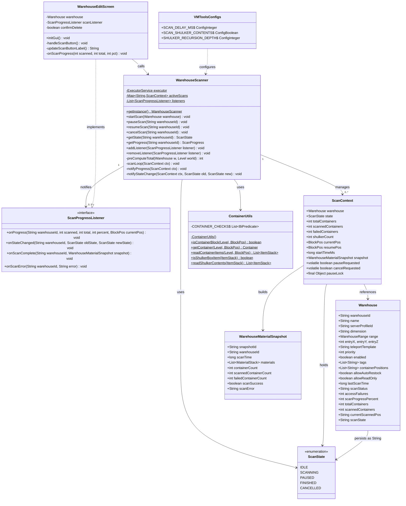
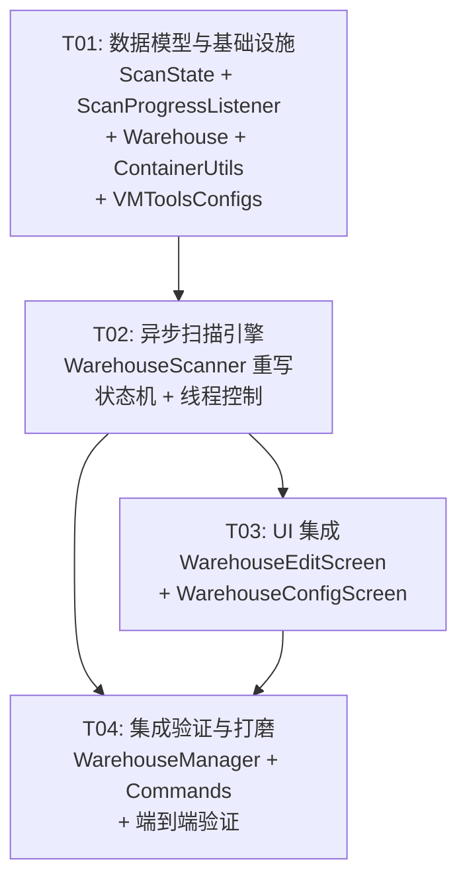

# VMTools v3 — 仓库扫描重构 系统设计

> **项目**：warehouse_scanner_v3_refactor
> **作者**：Bob (Architect)
> **日期**：2025-07-10

---

## Part A: 系统设计

### 1. 实现方案

#### 1.1 核心技术挑战

| 挑战 | 分析 | 方案 |
|------|------|------|
| 同步→异步 | 三重 XYZ 循环阻塞主线程，无法中断 | 独立 `Thread` + `volatile` 控制标志 |
| 暂停/恢复 | 需要在循环任意位置安全挂起 | `Object.wait()/notify()` + `BlockPos` 断点保存 |
| 进度追踪 | 需提前知道总数，但预扫描开销大 | 快扫预计算（仅 `isContainerBlock` 判断，不读物品） |
| 状态持久化 | Warehouse 对象需反映实时状态 | `Warehouse` 直接承载 `ScanState` + 进度字段 |
| 限速 | 容器间需插入可控延迟 | `Thread.sleep(scanDelayMs)` |
| 线程安全 | Warehouse 可被主线程+扫描线程同时访问 | `synchronized` 保护关键写路径，GUI 通过 `Minecraft.getInstance().execute()` 回主线程 |

#### 1.2 框架与库选型

| 用途 | 选择 | 理由 |
|------|------|------|
| 线程管理 | `java.util.concurrent.Executors.newSingleThreadExecutor()` | 轻量，自动管理线程生命周期，`Future` 可取消 |
| 暂停同步 | `Object.wait()/notifyAll()` | 零依赖，比 `CountDownLatch` 更适合可重复暂停/恢复 |
| 容器检测 | Minecraft 原生 `BlockState` / `BlockEntity` API | 无需额外库，Mojang Mappings 原生支持 |
| UI | Malilib `GuiBase` + `ButtonGeneric` | 现有架构，无需引入新 UI 框架 |
| 日志 | `VMToolsMod.LOGGER` (Log4j) | 已有基础设施 |

#### 1.3 架构模式

采用 **State Machine + Observer** 模式：

```
┌─────────────────────────────────────────────────┐
│                  WarehouseScanner                │
│  ┌──────────┐  ┌──────────────┐  ┌───────────┐  │
│  │ 状态管理  │  │  线程控制     │  │ 监听器列表 │  │
│  │ScanState │  │ Executor     │  │ Listeners │  │
│  └────┬─────┘  └──────┬───────┘  └─────┬─────┘  │
│       │               │               │         │
│  ┌────▼───────────────▼───────────────▼──────┐   │
│  │              ScanEngine                    │   │
│  │  XYZ Loop + pause/resume + rate limit     │   │
│  └────────────────────┬──────────────────────┘   │
└───────────────────────┼──────────────────────────┘
                        │
          ┌─────────────┼─────────────┐
          ▼             ▼             ▼
   ┌──────────┐  ┌──────────┐  ┌──────────────┐
   │ Warehouse│  │Container │  │MiniHudAdapter│
   │ (持久化)  │  │  Utils   │  │  (物品读取)   │
   └──────────┘  └──────────┘  └──────────────┘
```

### 2. 文件列表

```
VMTools-v3/src/main/java/com/vmtools/client/
├── scanner/                          # [NEW] 扫描器包
│   ├── ScanState.java                # [NEW] 扫描状态枚举
│   ├── ScanProgressListener.java     # [NEW] 进度回调接口
│   └── WarehouseScanner.java         # [REWRITE] 异步扫描器（从 warehouse/ 迁移）
├── warehouse/
│   └── WarehouseScanner.java         # [DELETE] 迁移至 scanner/
├── util/
│   └── ContainerUtils.java           # [MODIFY] 扩展容器检测至25种
├── data/
│   └── Warehouse.java                # [MODIFY] 新增扫描进度字段
├── gui/
│   └── WarehouseEditScreen.java      # [MODIFY] 异步扫描按钮 + 进度条
└── config/
    └── VMToolsConfigs.java           # [MODIFY] 新增 SCAN_DELAY_MS 配置项
```

### 3. 数据结构与接口



### 4. 程序调用流程

```mermaid
sequenceDiagram
    actor User
    participant UI as WarehouseEditScreen
    participant WS as WarehouseScanner
    participant Executor as ExecutorService
    participant Loop as ScanLoop (Thread)
    participant World as Minecraft Level
    participant CU as ContainerUtils
    participant MH as MiniHudAdapter
    participant W as Warehouse
    participant L as ScanProgressListener

    User->>UI: click "扫描"
    UI->>WS: startScan(warehouse)

    Note over WS: Phase 1: 预计算总数
    WS->>WS: validate(warehouse)
    WS->>World: preComputeTotal(range)
    loop XYZ (仅 isContainerBlock)
        WS->>CU: isContainerBlock(world, pos)
    end
    WS->>WS: create ScanContext(total=N)

    Note over WS: Phase 2: 更新状态
    WS->>W: scanState="SCANNING", scanProgressPercent=0
    WS->>UI: onStateChanged(IDLE→SCANNING)

    Note over WS: Phase 3: 提交异步任务
    WS->>Executor: submit(scanTask)

    Note over Loop: ─── 异步扫描循环 ───
    loop XYZ (从 resumePos 开始)
        Loop->>Loop: check cancelRequested → break
        Loop->>Loop: check pauseRequested → pauseLock.wait()

        Loop->>CU: isContainerBlock(world, pos)
        alt 是容器
            Loop->>MH: getContainerItems(world, pos)
            Loop->>Loop: addToSnapshot(items)
            Loop->>Loop: scannedContainers++
            Loop->>Loop: currentPos = pos

            alt 潜影盒递归
                Loop->>CU: isShulkerBoxItem(stack)
                Loop->>Loop: recurseShulker(snapshot, stack, ...)
            end

            Loop->>W: scanProgressPercent, scannedContainers, currentScannedPos
            Loop->>UI: onProgress(scanned, total, %, pos)
        end

        Loop->>Loop: Thread.sleep(scanDelayMs)
    end

    Note over Loop: 扫描完成
    Loop-->>WS: Future complete
    WS->>W: scanState="FINISHED", scanStatus="success"
    WS->>UI: onScanComplete(snapshot)

    rect rgb(255, 240, 220)
        Note over User,WS: ─── 暂停流程 ───
        User->>UI: click "暂停"
        UI->>WS: pauseScan(warehouseId)
        WS->>ScanContext: pauseRequested = true
        Loop->>Loop: save resumePos = currentPos
        Loop->>Loop: pauseLock.wait()
        WS->>W: scanState="PAUSED"
        WS->>UI: onStateChanged(SCANNING→PAUSED)
    end

    rect rgb(220, 255, 220)
        Note over User,WS: ─── 恢复流程 ───
        User->>UI: click "恢复"
        UI->>WS: resumeScan(warehouseId)
        WS->>ScanContext: pauseRequested = false
        WS->>ScanContext: pauseLock.notifyAll()
        WS->>W: scanState="SCANNING"
        WS->>UI: onStateChanged(PAUSED→SCANNING)
        Loop->>Loop: continue from resumePos
    end

    rect rgb(255, 220, 220)
        Note over User,WS: ─── 取消流程 ───
        User->>UI: click "取消"
        UI->>WS: cancelScan(warehouseId)
        WS->>ScanContext: cancelRequested = true
        WS->>ScanContext: pauseLock.notifyAll()
        Loop->>Loop: break out of loop
        WS->>Executor: future.cancel(true)
        WS->>W: scanState="CANCELLED"
        WS->>UI: onStateChanged(→CANCELLED)
    end
```

### 5. 待明确事项

| # | 事项 | 当前假设 | 影响 |
|---|------|----------|------|
| 1 | `totalContainers` 预计算是否需要计入潜影盒内部容器 | **不计入**，仅计 `isContainerBlock` 返回 true 的方块 | 进度条精度。若计入潜影盒内部，需要先递归展开所有潜影盒才能得到准确总数 |
| 2 | 暂停时已读取但未计入 snapshot 的容器如何处理 | **不处理**，暂停发生在容器读取完成后（原子边界） | 极端情况：若在 `addToSnapshot` 中途暂停，可能导致部分物品被重复计数 |
| 3 | 扫描线程的生命周期 | **一次性**：finish/cancel 后线程结束，不重用 | 若需重新扫描，需重新 `startScan`（重新预计算 + 新线程） |
| 4 | `scanDelayMs` 是每个容器后延迟还是每个坐标后延迟 | **每个容器读取后**延迟（非容器坐标不延迟） | 大型仓库（100+ 容器）的扫描总时长 = 容器数 × delayMs |
| 5 | 多处 UI 是否同时显示扫描进度 | **仅 WarehouseEditScreen** 显示实时进度，WarehouseListScreen 仅显示状态文字 | 若需全局进度提示，后续可通过 HUD 扩展 |
| 6 | `WarehouseScanner` 从 `warehouse/` 迁移到 `scanner/` 后，旧 import 如何处理 | **逐文件替换** import 语句 | `WarehouseManager`、`VMToolsCommands` 等可能有引用 |
| 7 | Dispenser/Dropper 在 Minecraft 中是 `DispenserBlock`/`DropperBlock`，内部使用 `DispenserBlockEntity`（继承 `RandomizableContainerBlockEntity`）| 已确认 | 容器检测准确 |

---

## Part B: 任务分解

### 6. 依赖包列表

本项目为 Minecraft Fabric Mod，依赖由 `build.gradle` 管理。本次重构**不新增**第三方依赖，仅使用 Java 21 标准库 + 现有 Minecraft/Fabric/Malilib API：

```
- Java 21 (java.base, java.util.concurrent)
- Minecraft 1.21.x (net.minecraft.* Mojang Mappings)
- Fabric Loader >=0.15.0 (net.fabricmc.loader.api.FabricLoader)
- Malilib (fi.dy.masa.malilib.*)
- MiniHUD (fi.dy.masa.minihud.util.InventoryUtils) — 可选依赖，已通过反射适配
```

### 7. 任务列表（按依赖排序）

#### T01: 数据模型与基础设施

| 属性 | 值 |
|------|---|
| **Task ID** | T01 |
| **Priority** | P0 |
| **Dependencies** | 无 |

**涉及的源文件**：

| 文件 | 操作 | 说明 |
|------|------|------|
| `scanner/ScanState.java` | 新建 | 五态枚举：IDLE / SCANNING / PAUSED / FINISHED / CANCELLED |
| `scanner/ScanProgressListener.java` | 新建 | 回调接口：onProgress / onStateChanged / onScanComplete / onScanError |
| `data/Warehouse.java` | 修改 | 新增 5 个字段：`scanProgressPercent`(int), `totalContainers`(int), `scannedContainers`(int), `currentScannedPos`(String), `scanState`(String)。保留原有 `scanStatus` 作为汇总状态 |
| `config/VMToolsConfigs.java` | 修改 | `WarehouseDefaults` 新增 `SCAN_DELAY_MS`(ConfigInteger, 默认20, 1~1000) |
| `util/ContainerUtils.java` | 修改 | `isContainerBlock()` 扩展至 25 种容器类型，内部使用 `List<BiPredicate<Level, BlockPos>>` 策略链 |

**ContainerUtils 扩展清单（25种）**：

| # | 容器 | 检测方式 |
|---|------|----------|
| 1 | Chest | `state.getBlock() instanceof ChestBlock` |
| 2 | Trapped Chest | `state.getBlock() instanceof TrappedChestBlock` *(1.21: `net.minecraft.world.level.block.TrappedChestBlock`)* |
| 3 | Barrel | `state.getBlock() instanceof BarrelBlock` |
| 4 | Hopper | `world.getBlockEntity(pos) instanceof HopperBlockEntity` |
| 5 | Dispenser | `state.getBlock() instanceof DispenserBlock` *(1.21: `net.minecraft.world.level.block.DispenserBlock`)* |
| 6 | Dropper | `state.getBlock() instanceof DropperBlock` *(1.21: `net.minecraft.world.level.block.DropperBlock`)* |
| 7 | Furnace | `world.getBlockEntity(pos) instanceof FurnaceBlockEntity` *(1.21: `net.minecraft.world.level.block.entity.FurnaceBlockEntity`)* |
| 8 | Blast Furnace | `world.getBlockEntity(pos) instanceof BlastFurnaceBlockEntity` |
| 9 | Smoker | `world.getBlockEntity(pos) instanceof SmokerBlockEntity` |
| 10-25 | 16色潜影盒 | `state.getBlock() instanceof ShulkerBoxBlock`（保留，原逻辑已覆盖所有颜色变体） |

> **注意**：Minecraft 1.21 中潜影盒颜色通过 `DyeColor` 属性区分，`ShulkerBoxBlock` 基类已覆盖全部 16 色变体。当前 `instanceof ShulkerBoxBlock` 即可命中所有颜色。

**完成标准**：
- `ScanState` 枚举编译通过
- `ScanProgressListener` 接口定义完整
- `Warehouse` 新字段可通过 GSON 序列化/反序列化
- `SCAN_DELAY_MS` 出现在配置界面
- `ContainerUtils.isContainerBlock()` 正确识别全部 25 种容器

---

#### T02: 异步扫描引擎

| 属性 | 值 |
|------|---|
| **Task ID** | T02 |
| **Priority** | P0 |
| **Dependencies** | T01 |

**涉及的源文件**：

| 文件 | 操作 | 说明 |
|------|------|------|
| `scanner/WarehouseScanner.java` | 重写 | 从 `warehouse/` 包迁入，完整重写为异步状态机 |
| `warehouse/WarehouseScanner.java` | 删除 | 旧文件移除 |

**WarehouseScanner 核心设计**：

```java
// 关键 API
public class WarehouseScanner {
    // 单例
    public static WarehouseScanner getInstance();

    // 状态控制（P0-1）
    public void startScan(Warehouse warehouse);       // IDLE/FINISHED/CANCELLED → SCANNING
    public void pauseScan(String warehouseId);        // SCANNING → PAUSED
    public void resumeScan(String warehouseId);       // PAUSED → SCANNING
    public void cancelScan(String warehouseId);       // SCANNING/PAUSED → CANCELLED

    // 查询
    public ScanState getState(String warehouseId);
    public ScanProgress getProgress(String warehouseId);  // record(scanned, total, percent, currentPos)

    // 监听器
    public void addListener(ScanProgressListener listener);
    public void removeListener(ScanProgressListener listener);
}
```

**内部结构**：

| 组件 | 说明 |
|------|------|
| `ExecutorService executor` | 单线程池，保证同一仓库扫描串行 |
| `Map<String, ScanContext> activeScans` | `ConcurrentHashMap`，跟踪活跃扫描 |
| `List<ScanProgressListener> listeners` | `CopyOnWriteArrayList`，线程安全通知 |
| `ScanContext` (内部类) | 持有 `Warehouse`、`ScanState`、进度计数器、`resumePos`、`pauseLock`、volatile 标志 |

**状态机转换规则**：

```
IDLE ──[startScan]──▶ SCANNING
SCANNING ──[pauseScan]──▶ PAUSED
PAUSED ──[resumeScan]──▶ SCANNING
SCANNING ──[自然完成]──▶ FINISHED
PAUSED ──[cancelScan]──▶ CANCELLED
SCANNING ──[cancelScan]──▶ CANCELLED
FINISHED ──[startScan]──▶ SCANNING   (允许重新扫描)
CANCELLED ──[startScan]──▶ SCANNING  (允许重新扫描)
```

**扫描循环伪代码**：

```java
void scanLoop(ScanContext ctx) {
    Warehouse w = ctx.warehouse;
    for (y = resumeY; y <= maxY; y++)
        for (x = resumeX; x <= maxX; x++)
            for (z = resumeZ; z <= maxZ; z++) {
                // 1. 检查取消
                if (ctx.cancelRequested) { cleanup(); return; }
                // 2. 检查暂停
                while (ctx.pauseRequested) {
                    saveResumePos(x, y, z);
                    transitionTo(PAUSED);
                    ctx.pauseLock.wait();  // blocked until resume
                    transitionTo(SCANNING);
                    restoreResumePos();
                }
                // 3. 扫描逻辑（同原 scan() 方法）
                BlockPos pos = new BlockPos(x, y, z);
                if (!ContainerUtils.isContainerBlock(world, pos)) continue;
                // ... 读物品、递归潜影盒、写 snapshot
                ctx.scannedContainers++;
                // 4. 进度通知
                notifyProgress(ctx);
                persistToWarehouse(ctx);
                // 5. 限速
                Thread.sleep(scanDelayMs);
            }
    // 完成
    transitionTo(FINISHED);
    notifyScanComplete(ctx);
}
```

**完成标准**：
- 异步扫描不阻塞主线程（客户端渲染帧率 >= 60fps）
- 暂停后恢复从 `resumePos` 继续，不重复扫描
- 取消后线程在 1 秒内终止
- `Warehouse` 对象状态实时更新（scanProgressPercent, currentScannedPos）

---

#### T03: UI 集成

| 属性 | 值 |
|------|---|
| **Task ID** | T03 |
| **Priority** | P1 |
| **Dependencies** | T02 |

**涉及的源文件**：

| 文件 | 操作 | 说明 |
|------|------|------|
| `gui/WarehouseEditScreen.java` | 修改 | 扫描按钮改为三态（扫描/暂停/恢复），新增进度条渲染 |
| `gui/WarehouseConfigScreen.java` | 修改 | 仓库列表行显示扫描状态图标和进度百分比 |

**WarehouseEditScreen 变更要点**：

1. **三态按钮**：
   - `ScanState.IDLE / FINISHED / CANCELLED` → 按钮显示「扫描」
   - `ScanState.SCANNING` → 按钮显示「⏸ 暂停」
   - `ScanState.PAUSED` → 按钮显示「▶ 恢复」

2. **进度条渲染**（在 Warehouse 信息行下方）：
   ```
   [████████░░░░░░░░] 58%  (145/250)  @ (12, 64, -340)
   ```

3. **监听器注册**：`initGui()` 时向 `WarehouseScanner` 注册 `ScanProgressListener`，`onClose()` 时移除

4. **线程安全**：监听器回调通过 `Minecraft.getInstance().execute()` 切回渲染线程更新 UI

**WarehouseConfigScreen 变更要点**：

- 仓库行标签增加扫描状态：`⚡SCANNING 45%` / `⏸ PAUSED` / `✓ SCANNED`

**完成标准**：
- 点击「扫描」按钮启动异步扫描，按钮立即变为「暂停」
- 扫描中进度条实时刷新
- 点击「暂停」→ 扫描暂停，按钮变为「恢复」
- 点击「恢复」→ 从断点继续，按钮变回「暂停」
- 扫描完成 → 显示汇总信息，按钮恢复「扫描」

---

#### T04: 集成验证与打磨

| 属性 | 值 |
|------|---|
| **Task ID** | T04 |
| **Priority** | P1 |
| **Dependencies** | T02, T03 |

**涉及的源文件**：

| 文件 | 操作 | 说明 |
|------|------|------|
| `warehouse/WarehouseManager.java` | 修改 | `save()` 持久化新增字段；`load()` 兼容旧数据（新字段默认值） |
| `data/DataSerializer.java` | 验证 | 确认 GSON 序列化/反序列化 Warehouse 新字段 |
| `command/VMToolsCommands.java` | 修改 | 新增 `/vmtools-scan <warehouse>` 和 `/vmtools-scan-cancel` 命令 |
| `gui/WarehouseListScreen.java` | 修改 | 列表页扫描状态显示（与 ConfigScreen 保持一致） |

**验证清单**：

| 场景 | 预期行为 |
|------|----------|
| 正常扫描完成 | SCANNING → FINISHED, 进度 100%, snapshot 正确 |
| 中途暂停再恢复 | 进度从暂停点继续，无重复/遗漏 |
| 扫描中取消 | 状态变为 CANCELLED，线程停止 |
| 扫描中退出世界 | 自动 PAUSED，状态持久化 |
| 旧 Warehouse JSON（无新字段）加载 | 新字段使用默认值（scanProgressPercent=0, scanState="IDLE"） |
| 大型仓库（10万方块） | 预计算 <2秒，扫描进度不卡顿 |
| 扫描限速 scanDelayMs=1000 | 每个容器间隔 1 秒 |
| scanDelayMs=1 | 全速扫描，无人工延迟感知 |
| 潜影盒递归 3 层 | 正确展开嵌套潜影盒 |
| 多个仓库同时扫描 | 各自独立状态，不互相干扰 |

**完成标准**：
- 上述所有场景通过手动验证
- `/vmtools-scan` 命令可启动扫描
- 旧配置文件加载不报错
- `WarehouseEditScreen` 关闭时自动移除 listener（无内存泄漏）

---

### 8. 共享知识

```
- 所有 Warehouse 状态持久化通过 WarehouseManager.save() → DataSerializer → GSON → JSON 文件
- 扫描线程仅通过 Minecraft.getInstance().level 读取世界，不修改方块
- MiniHudAdapter 为可选依赖，不可用时回退到直接 BlockEntity 访问
- ScanState 在 Warehouse 中存储为 String（scanState 字段），便于 JSON 序列化
- ScanProgressListener 回调在扫描线程中执行，UI 更新需通过 Minecraft.getInstance().execute() 回主线程
- scanDelayMs 仅对 isContainerBlock()==true 的坐标生效，非容器坐标无延迟
- 预计算 totalContainers 使用快扫模式（仅 isContainerBlock 判断，不调用 getContainerItems）
- 所有 BlockPos 比较使用 .equals()，不可用 ==
- 遵循 Google Java Style：4空格缩进，行宽≤120，类名 UpperCamelCase，方法名 lowerCamelCase
- 包名：scanner 包为 com.vmtools.client.scanner（与 warehouse/util/data/gui 同级）
```

### 9. 任务依赖图



---

> **Bob 的备注**：本设计将 `WarehouseScanner` 从 `warehouse/` 包迁移到新的 `scanner/` 包，与 VMTools 现有的 `build/`、`travel/`、`safety/` 包结构保持一致。旧文件的 import 路径需全局替换。`ScanContext` 设计为 `WarehouseScanner` 的**包私有内部类**而非独立文件，减少不必要的文件碎片化。

